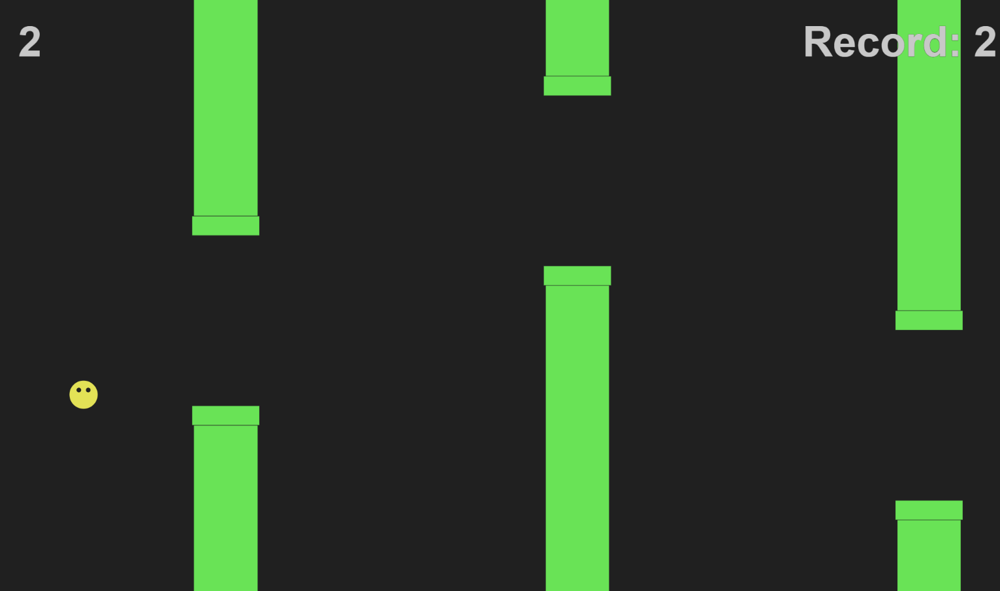

# js-flappy_dot
This is a little implementation of flappy bird I built using <a href="https://p5js.org/">p5.js</a>.
## URL
This proyect is hosted by github pages at <a href="https://pabloqb2000.github.io/js-flappy_dot/">this link</a>.
## Gamemodes
  - Easy
  - Medium
  - Hardcore: pipes start to move up and down randomly!!
## Screenshot
</img>
## References
To find more information about the <b>awesome</b> library used for this proyect visit:
<a href="https://p5js.org/"> https://p5js.org/ </a>

## Other proyects
Checkout my other proyects at <a href="https://pabloqb2000.github.io/Click_math/">Click math</a>